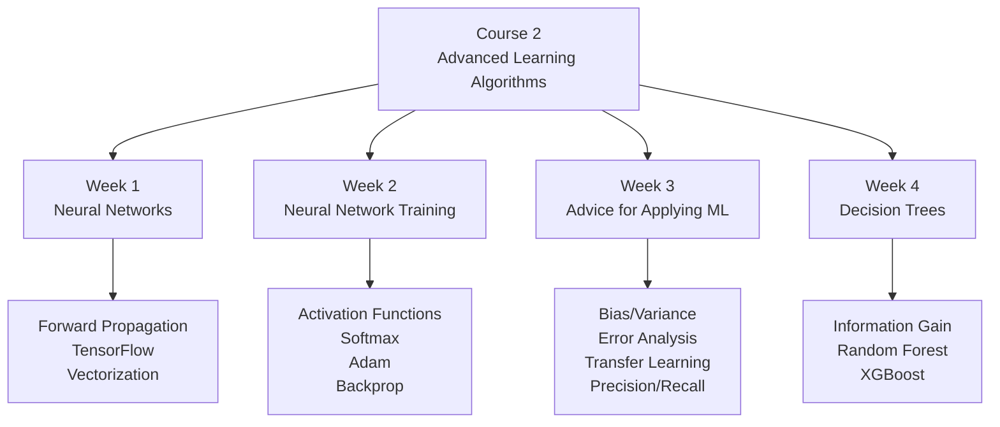

# Course 2：Advanced Learning Algorithms

## 📚 課程簡介

本課程深入介紹**神經網路**的架構與訓練，以及如何系統性地診斷和改進 ML 模型。最後介紹**決策樹**與集成方法。

---

## 🗂️ 週次索引

| 週次 | 標題 | 核心主題 |
|------|------|---------|
| Week 1 | [[C2-W1 - Neural Networks]] | 神經網路直覺、前向傳播、TensorFlow、矩陣乘法 |
| Week 2 | [[C2-W2 - Neural Network Training]] | 激活函數、Softmax、Adam、反向傳播 |
| Week 3 | [[C2-W3 - Advice for Applying ML]] | Bias/Variance、Error Analysis、Transfer Learning、Precision/Recall |
| Week 4 | [[C2-W4 - Decision Trees]] | 信息增益、Random Forest、XGBoost |

---

## 🔑 核心公式速查

### Neural Network Layer
$$\vec{a}^{[l]} = g\left(W^{[l]}\vec{a}^{[l-1]} + \vec{b}^{[l]}\right)$$

### Activation Functions
| 函數 | 公式 | 用途 |
|------|------|------|
| Sigmoid | $g(z) = \frac{1}{1+e^{-z}}$ | 輸出層（二元分類）|
| ReLU | $g(z) = \max(0, z)$ | 隱藏層（首選）|
| Softmax | $a_j = \frac{e^{z_j}}{\sum_k e^{z_k}}$ | 輸出層（多類別）|

### Bias & Variance Diagnosis
| 診斷 | $J_\text{train}$ | $J_\text{cv}$ |
|------|----|----|
| High Bias | 高 | 高 |
| High Variance | 低 | 遠高於 $J_\text{train}$ |
| Just Right | 低 | ≈ $J_\text{train}$ |

### Information Gain（Decision Tree）
$$IG = H(p_\text{root}) - \left(\frac{m_l}{m}H(p_l) + \frac{m_r}{m}H(p_r)\right)$$

### Entropy
$$H(p) = -p\log_2 p - (1-p)\log_2(1-p)$$

---

## 🔗 前往其他課程

- [[Course 1 - Index]] — Supervised Machine Learning
- [[Course 3 - Index]] — Unsupervised Learning, Recommenders, Reinforcement Learning
- [[ML Specialization - Master Index]] — 完整課程地圖
