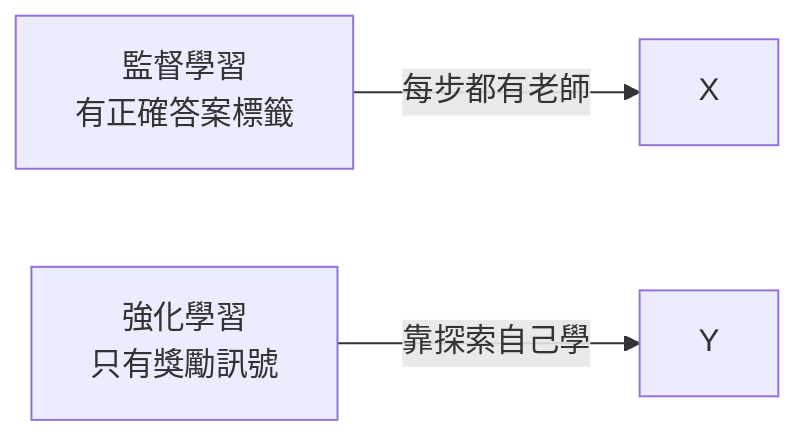
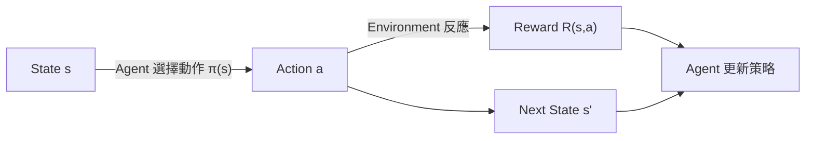
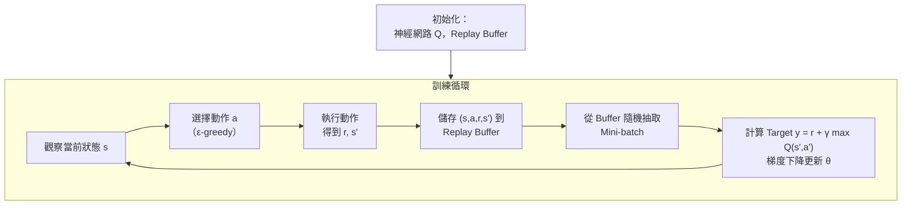

# Course 3 - Week 3: Reinforcement Learning

## 🗺️ Week Overview

```mermaid
mindmap
  root((Week 3))
    RL Fundamentals
      Agent & Environment
      States Actions Rewards
      Return & Discount
      Policy
      MDP
    State-Action Value
      Q(s,a) Definition
      Example
      Bellman Equation
      Random vs Stochastic
    Continuous States
      Lunar Lander
      Deep Q-Network
      Algorithm Refinements
        Replay Buffer
        Target Network
        Soft Update
        Greedy Policy
        Mini-batch
```

---

## 1. What is Reinforcement Learning?（什麼是強化學習？）

### 1.1 核心思想

**白話解釋：** 強化學習（RL）是讓電腦像人學習玩電動遊戲一樣——不告訴它「第幾步要按哪個鍵」，只告訴它「得分高就是好的，遊戲結束就是壞的」。透過不斷嘗試，它自己學會最好的策略。

**對比其他學習範式：**



### 1.2 應用場景

| 應用 | 狀態 $s$ | 動作 $a$ | 獎勵 $r$ |
|------|---------|---------|---------|
| 機器人控制 | 關節角度、速度 | 施加力矩 | 完成任務 |
| 遊戲 AI | 遊戲畫面 | 按鍵 | 得分 |
| 股票交易 | 市場狀態 | 買/賣/持有 | 利潤 |
| 直升機飛行 | 位置、速度 | 控制舵面 | 飛行穩定 |
| Lunar Lander | 位置、速度、角度 | 噴射引擎 | 成功著陸 |

---

## 2. Mars Rover Example（火星探測車範例）

**場景：** 火星探測車可以在 6 個格子中移動。

```
狀態:  1    2    3    4    5    6
獎勵: 100   0    0    0    0   40
```

- 每次可以選擇往左或往右移動
- 到達狀態 1 得 100 分，到達狀態 6 得 40 分，其他狀態得 0 分
- **目標：** 從當前位置出發，找到能獲得最多**長期累積獎勵**的移動策略

---

## 3. Return and Discount Factor（回報與折扣因子）

### 3.1 Return（回報）

**白話解釋：** 現在的獎勵比未來的獎勵更有價值（就像現在的 100 元比 10 年後的 100 元值錢）。

$$G_t = R_{t+1} + \gamma R_{t+2} + \gamma^2 R_{t+3} + \cdots = \sum_{k=0}^{\infty} \gamma^k R_{t+k+1}$$

- $\gamma$（gamma）：**折扣因子（discount factor）**，$0 < \gamma < 1$（通常取 0.9、0.99）
- $R_t$：在時間步 $t$ 獲得的即時獎勵
- 越遠的未來獎勵，折扣越大（$\gamma^k$ 越小）

**例子（$\gamma = 0.9$，從狀態 2 往左走到狀態 1）：**

$$G = 0 + 0.9 \times 100 = 90$$

**從狀態 2 往右走到狀態 6（需要 4 步）：**

$$G = 0 + 0.9 \times 0 + 0.9^2 \times 0 + 0.9^3 \times 0 + 0.9^4 \times 40 = 0.6561 \times 40 \approx 26.2$$

→ 往左（G=90）優於往右（G=26.2）

### 3.2 折扣因子的作用

| $\gamma$ | 行為特徵 |
|----------|---------|
| $\gamma \to 0$ | 只在意即時獎勵（短視）|
| $\gamma \to 1$ | 同等重視遠期獎勵（遠視）|
| $\gamma = 0.99$ | 長遠規劃，適合大多數任務 |

---

## 4. Making Decisions：Policies（決策策略）

### 4.1 Policy（策略）

$$\pi(s) = a$$

策略 $\pi$ 是一個函數：給定狀態 $s$，輸出應採取的動作 $a$。

**強化學習的目標：** 找到最優策略 $\pi^*$，使每個狀態的期望回報 $G$ 最大化。

---

## 5. Markov Decision Process（MDP）

強化學習的數學框架：



**馬可夫性質（Markov Property）：** 下一個狀態 $s'$ 只取決於當前狀態 $s$ 和動作 $a$，與更早的歷史無關。

---

## 6. State-Action Value Function Q(s,a)

### 6.1 定義

$$Q(s, a) = \text{從狀態 } s \text{ 採取動作 } a，然後用最優策略的期望回報}$$

更精確地說：

$$Q^*(s, a) = \text{在狀態 } s \text{ 採取動作 } a \text{ 後，遵循最優策略 } \pi^* \text{ 所能獲得的最大期望累積回報}$$

**如何用 Q 函數做決策：**

$$\pi^*(s) = \arg\max_a Q^*(s, a)$$

找讓 $Q$ 值最大的動作，就是最優動作。

### 6.2 範例（火星探測車）

| 狀態 | $Q(s, \text{左})$ | $Q(s, \text{右})$ | 最優動作 |
|------|-----------------|-----------------|---------|
| 2 | 12.5 | 6.25 | 左 |
| 3 | 25 | 12.5 | 左 |
| 4 | 50 | 25 | 左 |
| 5 | — | 40 | 右 |

---

## 7. Bellman Equation（貝爾曼方程）

### 7.1 核心方程

$$Q(s, a) = R(s) + \gamma \max_{a'} Q(s', a')$$

**分解：**
- $R(s)$：在狀態 $s$ 的**即時獎勵**
- $\gamma \max_{a'} Q(s', a')$：從下一狀態 $s'$ 開始，遵循最優策略的**折扣未來回報**

**白話解釋：** 「現在採取這個動作的價值 = 現在的獎勵 + 未來最好結果的折扣值」

### 7.2 驗證（火星探測車，$\gamma = 0.9$）

**計算 $Q(4, \text{左})$（狀態 4，往左走到狀態 3）：**

$$Q(4, \text{左}) = R(4) + \gamma \max_{a'} Q(3, a') = 0 + 0.9 \times \max(25, 12.5) = 0.9 \times 25 = 22.5$$

### 7.3 Terminal State（終止狀態）

在終止狀態（如到達目標），無後續動作：

$$Q(s_{\text{terminal}}, a) = R(s_{\text{terminal}})$$

---

## 8. Continuous State Spaces（連續狀態空間）

### 8.1 問題

現實任務中，狀態通常是**連續值**（不是離散格子），如：

**Lunar Lander 登月艙：**
$$s = (x, y, \dot{x}, \dot{y}, \theta, \dot{\theta}, l_1, l_2)$$

- $(x, y)$：位置
- $(\dot{x}, \dot{y})$：線速度
- $\theta$：傾斜角
- $\dot{\theta}$：角速度
- $l_1, l_2 \in \{0, 1\}$：左右腳架是否已著地

**動作 $a \in \{$無動作, 左引擎, 主引擎, 右引擎$\}$**

**獎勵設計：**
- 成功著陸：$+100 \sim +140$
- 每條腳架著地：$+10$
- 墜毀：$-100$
- 飛出畫面：$-100$
- 點火主引擎：$-0.3$ 每步（鼓勵節省燃料）

---

## 9. Deep Q-Network (DQN)（深度 Q 網路）

### 9.1 核心思想

用**神經網路**近似 $Q(s, a)$ 函數（因為連續狀態空間無法用表格列舉）：

$$Q_\theta(s, a) \approx Q^*(s, a)$$

### 9.2 訓練目標

利用 Bellman 方程作為訓練目標：

$$\text{Target} = R(s) + \gamma \max_{a'} Q(s', a'; \theta)$$

$$\text{Loss} = \left(Q(s, a; \theta) - \text{Target}\right)^2$$

### 9.3 DQN 完整流程



---

## 10. Algorithm Refinements（演算法改進）

### 10.1 Replay Buffer（經驗回放）

**問題：** 序列資料高度相關（前後狀態相似），直接用序列訓練不穩定。

**解決：** 儲存所有歷史 $(s, a, r, s')$ 到 Replay Buffer，每次訓練從中**隨機抽取 mini-batch**，打破時序相關性。

```python
# 概念
replay_buffer = deque(maxlen=100000)
replay_buffer.append((s, a, r, s_prime, done))

# 訓練時
batch = random.sample(replay_buffer, batch_size=64)
```

### 10.2 Target Network（目標網路）

**問題：** 訓練目標 $R + \gamma \max_{a'} Q(s', a'; \theta)$ 中的 $Q$ 也在更新，導致「追逐移動的目標」，訓練不穩定。

**解決：** 維護兩個網路：
- **主網路 $Q_\theta$：** 持續更新（每個 step）
- **目標網路 $Q_{\theta^-}$：** 每隔 $C$ 步才同步一次主網路的參數

$$\text{Target} = R + \gamma \max_{a'} Q(s', a'; \theta^-)$$

### 10.3 Soft Update（軟更新）

比每 $C$ 步硬更新更穩定的方式——每步用小比例混合：

$$\theta^- \leftarrow \tau \theta + (1 - \tau) \theta^-$$

（$\tau \ll 1$，如 $\tau = 0.005$）

### 10.4 Improved Neural Network Architecture

**更高效的網路：** 不是對每個 $(s, a)$ 對分別計算 $Q(s, a)$，而是一次性輸出所有動作的 $Q$ 值：

```
Input: s = [x, y, ẋ, ẏ, θ, θ̇, l₁, l₂]
Output: [Q(s, a₁), Q(s, a₂), Q(s, a₃), Q(s, a₄)]
         無動作    左引擎    主引擎    右引擎
```

這樣 $\max_a Q(s, a)$ 只需一次前向傳播，而非四次。

### 10.5 ε-Greedy Policy（探索與利用）

**困境：** 若總是選擇 $\arg\max_a Q(s, a)$，可能永遠不會探索到更好的動作。

$$\pi_\epsilon(s) = \begin{cases} \text{隨機動作} & \text{with probability } \epsilon \\ \arg\max_a Q(s,a) & \text{with probability } 1-\epsilon \end{cases}$$

**策略：** 訓練初期 $\epsilon$ 大（多探索），隨訓練進行逐步減小 $\epsilon$（更多利用）。

```
ε 從 1.0 開始，每個 episode 乘以 0.995，直到降到 0.01
```

---

## 11. 完整 DQN 演算法（虛擬碼）

```python
初始化 Q_network（主網路）, Q_target（目標網路）, Replay Buffer B

For episode = 1, ..., N:
    初始化狀態 s
    For step t = 1, ..., T:
        # 選擇動作（ε-greedy）
        if random() < ε:
            a = random_action()
        else:
            a = argmax_a Q_network(s, a)
        
        # 執行動作
        s', r, done = env.step(a)
        
        # 儲存經驗
        B.add((s, a, r, s', done))
        
        # 從 Buffer 取樣訓練
        if len(B) >= batch_size:
            batch = B.sample(batch_size)
            for (s_i, a_i, r_i, s'_i, done_i) in batch:
                if done_i:
                    target_i = r_i
                else:
                    target_i = r_i + γ * max_a Q_target(s'_i, a)
            
            # 梯度下降
            loss = MSE(Q_network(s_i, a_i), target_i)
            update Q_network via gradient descent
        
        # Soft Update 目標網路
        Q_target ← τ * Q_network + (1-τ) * Q_target
        
        s = s'
        if done: break
    
    ε = max(ε * decay, ε_min)
```

---

## 12. The State of Reinforcement Learning（RL 現狀）

**優點：**
- 能解決需要長期規劃的問題（遊戲、機器人、控制）
- 無需人工設計每一步的決策規則

**挑戰：**
- 訓練非常不穩定，需要大量技巧
- 需要**大量的環境互動**（樣本效率低）
- 在真實世界（非模擬器）部署困難
- 獎勵函數設計困難（Reward Shaping）

> **Andrew Ng 的觀點：** RL 在模擬環境中效果很好（遊戲），但在真實世界應用中仍有很多未解的挑戰。目前大多數商業 ML 應用仍以監督學習為主。

---

## 13. 重點總結

| 概念 | 核心公式 |
|------|---------|
| Return | $G_t = R_{t+1} + \gamma R_{t+2} + \gamma^2 R_{t+3} + \cdots$ |
| Bellman Equation | $Q(s,a) = R(s) + \gamma \max_{a'} Q(s', a')$ |
| Optimal Policy | $\pi^*(s) = \arg\max_a Q^*(s, a)$ |
| DQN Loss | $\mathcal{L} = (Q(s,a;\theta) - (r + \gamma \max_{a'} Q(s',a';\theta^-)))^2$ |
| Soft Update | $\theta^- \leftarrow \tau\theta + (1-\tau)\theta^-$ |
| ε-Greedy | 以 $\epsilon$ 機率探索，以 $1-\epsilon$ 機率利用 |

---

## 🔗 Related Notes

- [[C3-W2 - Recommender Systems & PCA]] — 其他無監督/自學習方法
- [[C2-W1 - Neural Networks]] — DQN 的核心網路結構
- [[C2-W2 - Neural Network Training]] — 神經網路訓練技巧
