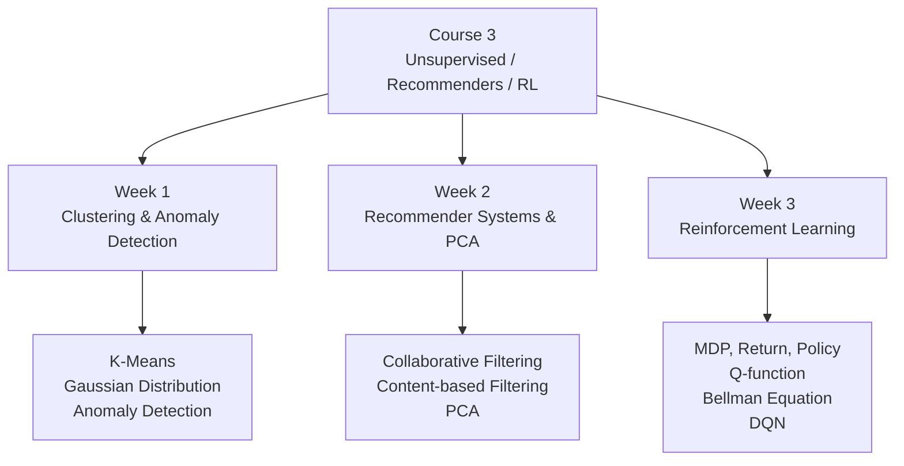

# Course 3：Unsupervised Learning, Recommenders, Reinforcement Learning

## 📚 課程簡介

本課程涵蓋**無監督學習**（聚類、異常偵測、降維）、**推薦系統**，以及**強化學習**的基礎理論與實作。

---

## 🗂️ 週次索引

| 週次 | 標題 | 核心主題 |
|------|------|---------|
| Week 1 | [[C3-W1 - Clustering & Anomaly Detection]] | K-Means、高斯分布、密度估計、異常偵測 |
| Week 2 | [[C3-W2 - Recommender Systems & PCA]] | 協同過濾、內容過濾、雙塔模型、PCA 降維 |
| Week 3 | [[C3-W3 - Reinforcement Learning]] | MDP、Return、Q-function、Bellman、DQN |

---

## 🔑 核心公式速查

### K-Means
$$c^{(i)} = \arg\min_k \|\vec{x}^{(i)} - \mu_k\|^2$$
$$\mu_k = \frac{1}{|C_k|}\sum_{c^{(i)}=k}\vec{x}^{(i)}$$
$$J = \frac{1}{m}\sum_{i=1}^{m}\|\vec{x}^{(i)} - \mu_{c^{(i)}}\|^2$$

### Anomaly Detection（Gaussian）
$$p(x) = \frac{1}{\sqrt{2\pi}\sigma}\exp\left(-\frac{(x-\mu)^2}{2\sigma^2}\right)$$
$$p(\vec{x}) = \prod_{j=1}^{n}p(x_j;\mu_j,\sigma_j^2)$$

### Collaborative Filtering
$$\hat{y}^{(i,j)} = \vec{w}^{(j)} \cdot \vec{x}^{(i)} + b^{(j)}$$

### PCA
$$z = U_\text{reduce}^T \cdot x$$

### Bellman Equation
$$Q(s,a) = R(s) + \gamma\max_{a'}Q(s',a')$$

### DQN Soft Update
$$\theta^- \leftarrow \tau\theta + (1-\tau)\theta^-$$

---

## 🔗 前往其他課程

- [[Course 1 - Index]] — Supervised Machine Learning
- [[Course 2 - Index]] — Advanced Learning Algorithms
- [[ML Specialization - Master Index]] — 完整課程地圖
