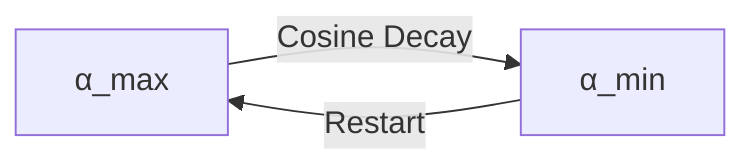
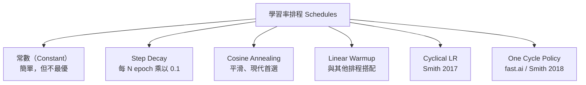

# KP-01：超參數與學習率（Hyperparameters & Learning Rate）

> **課程關聯：** 梯度下降中的 $\alpha$（學習率）首見於 [[C1-W1 - Introduction to Machine Learning#6. Gradient Descent（梯度下降）]]，超參數調整診斷見 [[C2-W3 - Advice for Applying ML]]

---

## 1. 學習率的基本性質（複習）

$$\theta \leftarrow \theta - \alpha \cdot \nabla_\theta J(\theta)$$

- $\alpha$ 太大 → 發散（overshoot）
- $\alpha$ 太小 → 收斂緩慢
- 最優 $\alpha$ 因模型、資料和優化器而異

---

## 2. 學習率排程（Learning Rate Schedules）

### 2.1 Cosine Annealing（餘弦退火）

**核心思想：** 讓學習率以餘弦曲線平滑衰減至近零，避免陡降帶來的訓練不穩定。

$$\alpha_t = \alpha_{\min} + \frac{1}{2}(\alpha_{\max} - \alpha_{\min})\left(1 + \cos\left(\frac{t}{T}\pi\right)\right)$$

**論文來源：**
> Loshchilov, I. & Hutter, F. (2017). **SGDR: Stochastic Gradient Descent with Warm Restarts.** *ICLR 2017.* [arxiv:1608.03983](https://arxiv.org/abs/1608.03983)

**Warm Restarts（熱重啟）：** 週期性地將學習率重置至峰值，讓模型跳出局部最優，探索更好的解。



### 2.2 Linear Warmup（線性預熱）

**白話解釋：** 訓練初期參數隨機，若學習率太大會造成梯度爆炸。Warmup 讓 $\alpha$ 從 0 線性增大到設定值，再開始正常衰減。

$$\alpha_t = \alpha_{\max} \cdot \frac{t}{t_{\text{warmup}}}, \quad t \leq t_{\text{warmup}}$$

**論文來源（Large-Batch 訓練）：**
> Goyal, P. et al. (2017). **Accurate, Large Minibatch SGD: Training ImageNet in 1 Hour.** [arxiv:1706.02677](https://arxiv.org/abs/1706.02677)

**現代實踐：** 幾乎所有大型 Transformer 模型（BERT、GPT、LLaMA 等）都採用 Warmup + Cosine Decay 的組合。

### 2.3 常見排程一覽



### 2.4 One Cycle Policy

**論文來源：**
> Smith, L.N. & Topin, N. (2019). **Super-Convergence: Very Fast Training of Neural Networks Using Large Learning Rates.** *WACV 2019.* [arxiv:1708.07120](https://arxiv.org/abs/1708.07120)

學習率先從 $\alpha_{\min}$ 升至 $\alpha_{\max}$，再降至 $\alpha_{\min}/100$，同時動量反向調整，可大幅加速訓練收斂。

---

## 3. Batch Size 與學習率的關係

**線性縮放法則：** 若 Batch Size 增大 $k$ 倍，相應地將 $\alpha$ 也乘以 $k$：

$$\alpha_{\text{new}} = \alpha_{\text{base}} \times \frac{B_{\text{new}}}{B_{\text{base}}}$$

**論文來源：**
> Goyal, P. et al. (2017). *Accurate, Large Minibatch SGD.* [arxiv:1706.02677](https://arxiv.org/abs/1706.02677)

**限制：** 此線性關係在超大 Batch Size 時失效（需 Warmup 緩衝）。

---

## 4. 梯度裁剪（Gradient Clipping）

**問題：** 梯度爆炸（gradient explosion）在 RNN、Transformer 等深層網路中常見。

**Norm Clipping（L2 norm 裁剪）：**

$$\text{if } \|\nabla\theta\| > \text{clip\_norm}: \quad \nabla\theta \leftarrow \frac{\text{clip\_norm}}{\|\nabla\theta\|} \nabla\theta$$

```python
torch.nn.utils.clip_grad_norm_(model.parameters(), max_norm=1.0)
```

**論文來源：**
> Pascanu, R., Mikolov, T. & Bengio, Y. (2013). **On the difficulty of training recurrent neural networks.** *ICML 2013.* [arxiv:1211.5063](https://arxiv.org/abs/1211.5063)

---

## 5. 超參數搜尋的系統方法（2020+ 進展）

### 5.1 Random Search 優於 Grid Search

**論文來源：**
> Bergstra, J. & Bengio, Y. (2012). **Random Search for Hyper-Parameter Optimization.** *JMLR 2012.* — 奠定了隨機搜尋的理論基礎

### 5.2 Hyperband + Bayesian Optimization

> Li, L. et al. (2018). **Hyperband: A Novel Bandit-Based Approach to Hyperparameter Optimization.** *JMLR 2018.* [arxiv:1603.06212](https://arxiv.org/abs/1603.06212)

結合 Successive Halving（提前終止差的配置）和 Bandit 策略，在計算資源有限的情況下高效搜尋。

### 5.3 μP（Maximal Update Parametrization）

**重大突破（2022）：** 超參數（包括學習率）可以在小模型上調好後直接遷移至大模型，無需重新搜尋。

**論文來源：**
> Yang, G. et al. (2022). **Tensor Programs V: Tuning Large Neural Networks via Zero-Shot Hyperparameter Transfer.** [arxiv:2203.03466](https://arxiv.org/abs/2203.03466)

**實踐意義：** 微軟等公司用此方法大幅降低大型 LLM 調參成本。

---

## 6. 學習率與損失曲面幾何

### 6.1 Flat Minima 假說

**白話解釋：** 在「平坦」的最小值附近，參數稍微移動，損失變化不大，泛化能力更強；「尖銳」的最小值則相反。

> Hochreiter, S. & Schmidhuber, J. (1997). *Flat Minima.* Neural Computation.

### 6.2 SAM（Sharpness-Aware Minimization）

SAM 直接最小化「最壞情況下鄰域的損失」，強制找到平坦最小值：

$$\min_\theta \max_{\|\epsilon\| \leq \rho} J(\theta + \epsilon)$$

> Foret, P., Kleiner, A., Mobahi, H. & Neyshabur, B. (2021). **Sharpness-Aware Minimization for Efficiently Improving Generalization.** *ICLR 2021.* [arxiv:2010.01412](https://arxiv.org/abs/2010.01412)

詳見 → [[KP-02 - 現代優化器#SAM]]

---

## 7. 重點總結

| 技術 | 論文 | 年份 | 關鍵貢獻 |
|------|------|------|---------|
| Cosine Annealing | Loshchilov & Hutter | 2017 | 平滑 LR 衰減，Warm Restarts |
| Linear Warmup | Goyal et al. | 2017 | 大 batch 訓練穩定化 |
| Linear LR Scaling | Goyal et al. | 2017 | Batch Size ↑k → LR ↑k |
| Gradient Clipping | Pascanu et al. | 2013 | 防止梯度爆炸 |
| μP Parametrization | Yang et al. | 2022 | 超參數從小模型遷移至大模型 |

---

## 🔗 相關知識點

- [[KP-02 - 現代優化器]] — Adam、AdamW、Lion、SAM
- [[KP-03 - 損失函數]] — 損失函數形狀影響最優學習率
- [[KP-07 - 縮放法則與湧現能力]] — 大模型中的學習率策略

## 🔗 相關課程筆記

- [[C1-W1 - Introduction to Machine Learning]] — 梯度下降基礎
- [[C2-W3 - Advice for Applying ML]] — 超參數搜尋診斷
