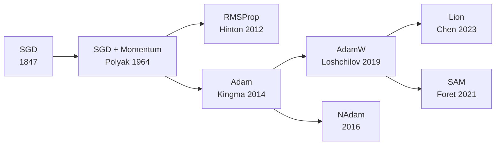
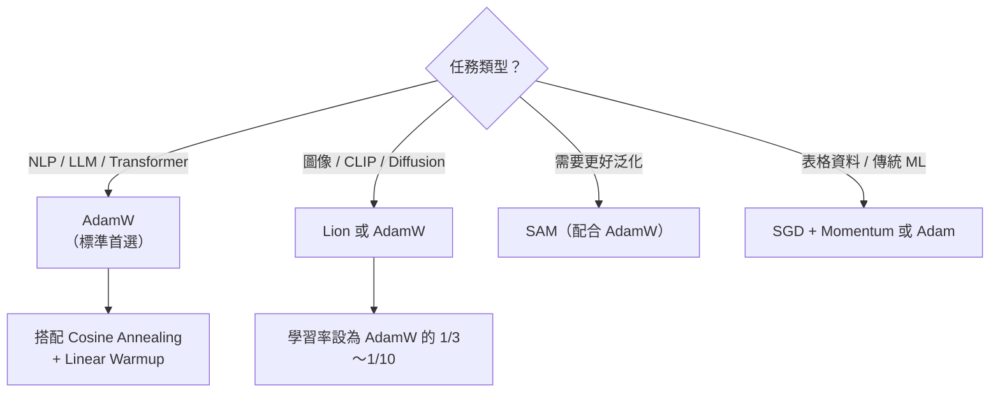

# KP-02：現代優化器（Modern Optimizers）

> **課程關聯：** Adam 首見於 [[C2-W2 - Neural Network Training#4. Advanced Optimization（Adam Optimizer）]]；梯度下降基礎見 [[C1-W1 - Introduction to Machine Learning#6. Gradient Descent（梯度下降）]]

---

## 1. 優化器演化路徑



---

## 2. SGD + Momentum（基礎）

$$v_t = \beta v_{t-1} + \nabla_\theta J(\theta)$$
$$\theta \leftarrow \theta - \alpha v_t$$

- $\beta$：動量係數，通常 $0.9$
- **白話：** 梯度更新帶有「慣性」，往歷史方向繼續走，能穿越淺層局部最小值

> [!tip] 🎯 白話舉例：動量像保齡球的慣性
> 想像你在滑雪場推一顆保齡球下山。沒有動量時，球只會往「當前最陡」的方向滾，可能卡在一個小坑裡。加了動量後，球有**慣性**——即使到了小坑，之前累積的速度讓它能滾過小坑，繼續往更低的地方去。

---

## 3. Adam（Adaptive Moment Estimation）

$$m_t = \beta_1 m_{t-1} + (1-\beta_1) g_t \quad \text{(一階矩/動量)}$$
$$v_t = \beta_2 v_{t-1} + (1-\beta_2) g_t^2 \quad \text{(二階矩/方差)}$$
$$\hat{m}_t = \frac{m_t}{1-\beta_1^t}, \quad \hat{v}_t = \frac{v_t}{1-\beta_2^t} \quad \text{(偏差校正)}$$
$$\theta \leftarrow \theta - \frac{\alpha}{\sqrt{\hat{v}_t} + \epsilon} \hat{m}_t$$

**預設超參數：** $\beta_1=0.9$，$\beta_2=0.999$，$\epsilon=10^{-8}$

> Kingma, D.P. & Ba, J. (2015). **Adam: A Method for Stochastic Optimization.** *ICLR 2015.* [arxiv:1412.6980](https://arxiv.org/abs/1412.6980)

**Adam 的收斂性修正：** 原始 Adam 論文的收斂證明有誤，後經 Reddi et al. 指出並提出 AMSGrad 修正：
> Reddi, S.J., Kale, S. & Kumar, S. (2018). **On the Convergence of Adam and Beyond.** *ICLR 2018.* [arxiv:1904.09237](https://arxiv.org/abs/1904.09237)

> [!tip] 🎯 白話舉例：Adam 像智慧型 GPS 導航
> 想像 SGD 是「只看眼前路況」的駕駛，而 Adam 是**智慧型 GPS 導航**：
> - **$m_t$（動量）** = GPS 記住「最近幾次你都往哪個方向轉」，綜合了方向資訊
> - **$v_t$（方差）** = GPS 記住「這條路通常波動多大」，自動調整速度——平坦大道加速，崎嶇小路減速
> - **偏差校正** = 剛啟動 GPS 時資訊不足，需要額外補償

---

## 4. AdamW（Decoupled Weight Decay）

### 4.1 問題：Adam 中的 L2 ≠ Weight Decay

**核心發現：** 在 Adam 中，L2 正則化 **不等於** Weight Decay。

- **L2 正則化（Adam 的原始做法）：** 將 $\lambda\theta$ 加入梯度，再被 Adam 的自適應縮放因子 $\sqrt{\hat{v}_t}$ 縮小，導致大梯度的參數受到的正則化 **更少**
- **Decoupled Weight Decay（AdamW）：** 直接從參數中減去 $\lambda\theta$，不受自適應縮放影響

### 4.2 AdamW 更新規則

$$\theta \leftarrow \theta - \alpha \cdot \frac{\hat{m}_t}{\sqrt{\hat{v}_t} + \epsilon} - \alpha \lambda \theta$$

注意：Weight Decay 項 $\alpha \lambda \theta$ 是**單獨**計算的，與梯度更新步驟解耦。

**論文來源：**
> Loshchilov, I. & Hutter, F. (2019). **Decoupled Weight Decay Regularization.** *ICLR 2019.* [arxiv:1711.05101](https://arxiv.org/abs/1711.05101)

### 4.3 實踐意義

- AdamW 是目前訓練 **Transformer / LLM** 的標準優化器（BERT, GPT, LLaMA 皆使用）
- 典型設定：$\text{weight\_decay} = 0.01 \sim 0.1$，$\alpha = 10^{-4} \sim 10^{-3}$

```python
optimizer = torch.optim.AdamW(model.parameters(), lr=3e-4, weight_decay=0.1)
```

> [!tip] 🎯 白話舉例：AdamW 的 Weight Decay 像定期清理倉庫
> 想像你開一家店，每天都會進新貨（學習新知識）。如果不定期清理，倉庫會堆滿過期商品（無用的大參數）。
> - **L2 正則化（在 Adam 中）** = 清理人員只能在進貨員忙完後才能清理，而且越忙的貨架（大梯度的參數）反而清理得**越少**
> - **AdamW（Weight Decay）** = 清理人員**獨立作業**，不管進貨員忙不忙，每天都均勻地清掉一定比例的舊貨
> 這就是「解耦」的意義——清理（正則化）與進貨（梯度更新）分開結算。

---

## 5. Lion（EvoLved Sign Momentum）

### 5.1 核心創新

Lion 由 Google Brain 用**程序搜尋（program search / evolutionary algorithm）**自動發現，而非人工設計。

**Lion 更新規則：**

$$c_t = \beta_1 m_{t-1} + (1-\beta_1) g_t$$
$$\theta \leftarrow \theta - \alpha \cdot \text{sign}(c_t) - \alpha \lambda \theta$$
$$m_t = \beta_2 m_{t-1} + (1-\beta_2) g_t$$

關鍵特徵：**sign 操作** — 每個參數的更新幅度統一（$\pm 1$），類似於對所有維度施加等強度的正則化噪聲。

**論文來源：**
> Chen, X. et al. (2023). **Symbolic Discovery of Optimization Algorithms.** *NeurIPS 2023.* [arxiv:2302.06675](https://arxiv.org/abs/2302.06675)

> [!tip] 🎯 白話舉例：Lion 的 sign 操作像投票表決
> AdamW 對每個參數的更新幅度都不同（像各部門自行決定預算），而 Lion 用 sign 操作——每個參數只投「贊成（+1）」或「反對（-1）」，更新幅度一律相同。這像民主投票——每人只有一票，不管你多有錢。這種「平等」帶來的隨機性反而有正則化效果。

### 5.2 Lion vs AdamW 比較

| 特性 | AdamW | Lion |
|------|-------|------|
| 記憶體佔用 | 需儲存 $m_t, v_t$ | 只需儲存 $m_t$（節省 1/3）|
| 學習率 | 較大 | 需要更小（約 $1/3 \sim 1/10$）|
| 收斂行為 | 平滑自適應 | 均勻更新幅度 |
| 已驗證場景 | 通用（LLM、ViT）| ViT, CLIP, Diffusion（圖像效果尤佳）|
| 小 batch size | 良好 | 較差（$< 64$）|

---

## 6. SAM（Sharpness-Aware Minimization）

### 6.1 核心思想

標準優化只追求「損失最低的點」，但 SAM 同時追求「周圍鄰域損失也低的平坦最小值」。參見 [[KP-01 - 超參數與學習率#6.1 Flat Minima 假說]] 了解為什麼「平坦」重要。

**最佳化目標：**

$$\min_\theta \max_{\|\epsilon\|_2 \leq \rho} J(\theta + \epsilon)$$

**兩步更新：**

1. **擾動步：** 找到讓損失最大的 $\epsilon^* = \rho \cdot \hat{g} / \|\hat{g}\|$（爬上最陡坡）
2. **下降步：** 在 $\theta + \epsilon^*$ 處計算梯度，執行梯度下降

**論文來源：**
> Foret, P., Kleiner, A., Mobahi, H. & Neyshabur, B. (2021). **Sharpness-Aware Minimization for Efficiently Improving Generalization.** *ICLR 2021.* [arxiv:2010.01412](https://arxiv.org/abs/2010.01412)

### 6.2 SAM 的代價

- 每個 step 需計算**兩次前向/反向傳播**（計算成本 ×2）
- ESAM（Efficient SAM）透過隨機子集擾動降低成本

### 6.3 應用效果

- 在 CIFAR-10/100、ImageNet 均顯著提升準確率
- 對 **label noise** 天然具有魯棒性
- 已被用於 ViT fine-tuning 和語言模型訓練

> [!tip] 🎯 白話舉例：SAM 像找最穩固的山谷筆記
> 普通優化器只找「最低的點」——可能是一個很窄的深坑。SAM 則是先往周圍探一圈（擾動步），確認「即使我稍微偏離，這裡仍然很低」，才決定停在這裡。這就像找房子時，不只看房子本身，還要看**周圍環境**是否穩定——一個在懸崖邊的便宜房（尖銳最小值）不如一個在平原上的稍貴房（平坦最小值）。

---

## 7. 優化器的選擇指南



---

## 8. 重點論文彙整

| 論文 | 年份 | arxiv | 貢獻 |
|------|------|-------|------|
| Adam | 2015 | [1412.6980](https://arxiv.org/abs/1412.6980) | 自適應學習率，動量+方差估計 |
| AdamW | 2019 | [1711.05101](https://arxiv.org/abs/1711.05101) | 解耦 Weight Decay，LLM 標準 |
| SAM | 2021 | [2010.01412](https://arxiv.org/abs/2010.01412) | 平坦最小值，改善泛化 |
| Lion | 2023 | [2302.06675](https://arxiv.org/abs/2302.06675) | 程序搜尋發現，記憶體高效 |

---

## 🔗 相關知識點

- [[KP-01 - 超參數與學習率]] — 學習率排程與調整策略（Cosine、WSD、Warmup）
- [[KP-03 - 損失函數]] — 損失函數形狀影響優化器行為（平坦 vs 尖銳曲面）
- [[KP-04 - 正則化技術]] — Weight Decay 與正則化的關係（AdamW 解耦設計）
- [[KP-05 - 激活函數]] — 激活函數影響梯度流，進而影響優化器效率
- [[KP-07 - 縮放法則與湧現能力]] — 大模型訓練中優化器的選擇與 Chinchilla 配置

## 🔗 相關課程筆記

- [[C1-W1 - Introduction to Machine Learning]] — 梯度下降基礎與學習率 $\alpha$ 的角色
- [[C2-W2 - Neural Network Training]] — Adam Optimizer 介紹與反向傳播
- [[C2-W3 - Advice for Applying ML]] — 模型診斷與超參數調整策略
