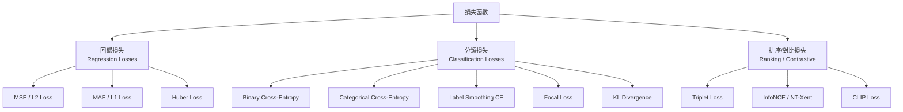
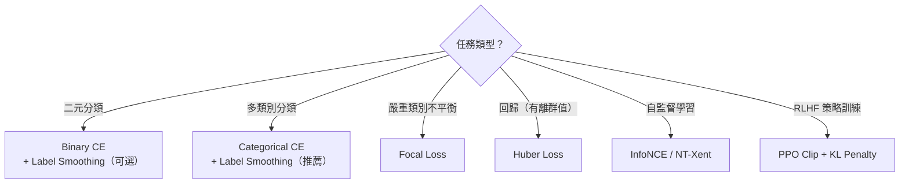

# KP-03：損失函數（Loss Functions & Training Objectives）

> **課程關聯：** Logistic Loss / Cross-Entropy 首見於 [[C1-W3 - Classification#4. Cost Function for Logistic Regression（邏輯回歸成本函數）]]；Softmax Loss 見 [[C2-W2 - Neural Network Training#3. Multiclass Classification（多類別分類）]]

---

## 1. 損失函數家族總覽



---

## 2. Cross-Entropy Loss（交叉熵，基礎）

$$\mathcal{L}_{\text{CE}} = -\sum_{c=1}^{C} y_c \log \hat{p}_c$$

- **Binary CE（二元）：** $\mathcal{L} = -[y \log \hat{p} + (1-y)\log(1-\hat{p})]$ → 見 [[C1-W3 - Classification]]
- **Categorical CE（多類別）：** $\mathcal{L} = -\log \hat{p}_{y}$ → 見 [[C2-W2 - Neural Network Training]]

**資訊理論視角：** Cross-Entropy = Entropy + KL Divergence

$$H(p, q) = H(p) + D_{\text{KL}}(p \| q)$$

最小化 CE ≡ 最小化 $D_{\text{KL}}(p_{\text{data}} \| p_{\text{model}})$

---

## 3. Label Smoothing（標籤平滑，2020+ 廣泛使用）

### 3.1 問題：Hard Labels 的過度自信

**白話解釋：** 若用 $y \in \{0, 1\}$ 硬標籤訓練，模型會試圖讓 Softmax 輸出趨近 0 或 1（需要 logit → ±∞），造成**過度自信（overconfidence）**，在測試集上校準差。

### 3.2 Label Smoothing 定義

將 hard label 替換為 soft label：

$$\tilde{y}_c = (1 - \epsilon) \cdot y_c + \frac{\epsilon}{C}$$

其中 $\epsilon$ 通常取 $0.1$，$C$ 為類別數。

**效果：** 每個正確類別的目標概率從 $1.0$ 降至 $1 - \epsilon + \epsilon/C \approx 0.9$，其餘類別從 $0$ 升至 $\epsilon/C$。

**論文來源（分析研究）：**
> Müller, R., Kornblith, S. & Hinton, G. (2020). **When Does Label Smoothing Help?** *NeurIPS 2019.* [arxiv:1906.02629](https://arxiv.org/abs/1906.02629)

**關鍵發現：** Label Smoothing 讓模型學到**更緊密、更緊湊的表示**，並改善模型校準（calibration），但會**損害知識蒸餾（knowledge distillation）**的效果。

**原始提出：**
> Szegedy, C. et al. (2016). *Rethinking the Inception Architecture.* *CVPR 2016.*

### 3.3 實作

```python
import torch.nn as nn
criterion = nn.CrossEntropyLoss(label_smoothing=0.1)
```

---

## 4. Focal Loss（聚焦損失）

### 4.1 動機：類別不平衡

**白話解釋：** 在目標偵測中，大量「背景」框（易分類）主導了訓練，淹沒了少量「前景」框（難分類）的學習訊號。

### 4.2 定義

$$\mathcal{L}_{\text{Focal}} = -\alpha_t (1 - p_t)^\gamma \log(p_t)$$

- $p_t$：模型對正確類別的預測概率
- $(1 - p_t)^\gamma$：**調制因子** — 若模型已很有信心（$p_t$ 高），則降低損失權重
- $\gamma$（focusing parameter）：通常取 2；$\gamma=0$ 退化為標準 CE
- $\alpha_t$：類別平衡因子

**白話：** 「越容易分類的樣本，貢獻越小的損失；越難分類的樣本，損失越被放大。」

**論文來源：**
> Lin, T.Y. et al. (2017). **Focal Loss for Dense Object Detection.** *ICCV 2017.* [arxiv:1708.02002](https://arxiv.org/abs/1708.02002)

**應用場景：** 目標偵測（RetinaNet）、不平衡分類任務（見 [[C2-W3 - Advice for Applying ML#5. Skewed Datasets]]）

---

## 5. KL Divergence（KL 散度）

$$D_{\text{KL}}(P \| Q) = \sum_x P(x) \log \frac{P(x)}{Q(x)}$$

- **非對稱：** $D_{\text{KL}}(P\|Q) \neq D_{\text{KL}}(Q\|P)$
- **用於：** 知識蒸餾、VAE（Variational Autoencoder）、RLHF 中限制策略偏差

**RLHF 中的 KL 懲罰（重要！）：**

$$\mathcal{L}_{\text{RLHF}} = r_\theta(x, y) - \beta \cdot D_{\text{KL}}[\pi_\theta(y|x) \| \pi_{\text{ref}}(y|x)]$$

防止模型在優化獎勵時過度偏離原始語言模型分布。詳見 → [[KP-09 - RLHF 與現代強化學習]]

---

## 6. Huber Loss（魯棒回歸損失）

$$\mathcal{L}_\delta(y, \hat{y}) = \begin{cases} \frac{1}{2}(y-\hat{y})^2 & |y - \hat{y}| \leq \delta \\ \delta \cdot (|y-\hat{y}| - \frac{\delta}{2}) & \text{otherwise} \end{cases}$$

- 小誤差：等同 MSE（平滑）
- 大誤差：等同 MAE（對離群值魯棒）
- 常用於 DQN（詳見 [[C3-W3 - Reinforcement Learning]]）和目標偵測回歸頭

---

## 7. 對比損失與 InfoNCE（Contrastive Losses）

### 7.1 Triplet Loss

$$\mathcal{L} = \max(0, \|f(a) - f(p)\|^2 - \|f(a) - f(n)\|^2 + m)$$

- $a$：anchor；$p$：positive（同類）；$n$：negative（不同類）；$m$：margin

### 7.2 InfoNCE（NT-Xent，SimCLR 使用）

給定 batch 中的 $N$ 對正樣本對，對於正對 $(i, j)$：

$$\mathcal{L}_{i,j} = -\log \frac{\exp(\text{sim}(z_i, z_j)/\tau)}{\sum_{k=1}^{2N} \mathbf{1}_{[k \neq i]} \exp(\text{sim}(z_i, z_k)/\tau)}$$

- $\tau$：溫度參數（temperature），控制分布的「尖銳程度」
- $\text{sim}(u,v) = u^T v / (\|u\|\|v\|)$：餘弦相似度
- Batch 中所有其他 $2(N-1)$ 個樣本作為 negative

**論文來源：**
> Chen, T. et al. (2020). **A Simple Framework for Contrastive Learning of Visual Representations (SimCLR).** *ICML 2020.* [arxiv:2002.05709](https://arxiv.org/abs/2002.05709)

詳見 → [[KP-08 - 自監督與對比學習]]

### 7.3 溫度參數 $\tau$ 的作用

| $\tau$ | 效果 |
|--------|------|
| $\tau$ 小（如 0.07）| 分布尖銳，hard negatives 重要，訓練難 |
| $\tau$ 大（如 1.0）| 分布平緩，易訓練，但表示區分性弱 |

---

## 8. 損失函數選擇指南



---

## 9. 重點論文彙整

| 論文 | 年份 | arxiv | 貢獻 |
|------|------|-------|------|
| Label Smoothing analysis | 2020 | [1906.02629](https://arxiv.org/abs/1906.02629) | 何時有效，校準改善，蒸餾風險 |
| Focal Loss | 2017 | [1708.02002](https://arxiv.org/abs/1708.02002) | 類別不平衡，目標偵測 |
| SimCLR / InfoNCE | 2020 | [2002.05709](https://arxiv.org/abs/2002.05709) | 對比學習損失，溫度參數 |

---

## 🔗 相關知識點

- [[KP-08 - 自監督與對比學習]] — InfoNCE 在 SimCLR、CLIP 中的應用
- [[KP-09 - RLHF 與現代強化學習]] — RLHF 的獎勵損失與 KL 懲罰
- [[KP-02 - 現代優化器]] — 損失形狀與優化器的互動

## 🔗 相關課程筆記

- [[C1-W3 - Classification]] — Binary Cross-Entropy 推導
- [[C2-W2 - Neural Network Training]] — Softmax + Categorical CE
- [[C2-W3 - Advice for Applying ML]] — 不平衡資料集（Skewed Datasets）
