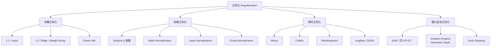

# KP-04：正則化技術（Regularization Techniques）

> **課程關聯：** L2 正則化基礎見 [[C1-W3 - Classification#7. Regularization（正則化）]]；Overfitting/Underfitting 診斷見 [[C2-W3 - Advice for Applying ML]]

---

## 1. 正則化技術全景

---

## 2. L1 / L2 正則化（複習）

> 詳見 [[C1-W3 - Classification#7. Regularization（正則化）]]

**L2（Weight Decay）：**
$$J_{\text{reg}} = J + \frac{\lambda}{2m}\sum_j w_j^2 \quad \Rightarrow \quad w_j \leftarrow w_j(1 - \alpha\lambda/m) - \alpha\nabla_w J$$

**L1（Lasso）：**
$$J_{\text{reg}} = J + \frac{\lambda}{m}\sum_j |w_j| \quad \Rightarrow \quad \text{稀疏解（sparse weights）}$$

**2020+ 重要進展：** AdamW 修正了 Adam 中 L2 ≠ Weight Decay 的問題（詳見 [[KP-02 - 現代優化器#AdamW]]）。

---

## 3. Dropout 及其現代變體

### 3.1 標準 Dropout

$$\tilde{a}_j = \begin{cases} a_j / (1-p) & \text{with prob. } 1-p \\ 0 & \text{with prob. } p \end{cases}$$

**論文來源：**
> Srivastava, N. et al. (2014). **Dropout: A Simple Way to Prevent Neural Networks from Overfitting.** *JMLR 2014.*

**白話：** 訓練時隨機「關掉」部分神經元，強迫網路學習冗餘的、不依賴特定節點的表示。

### 3.2 DropPath / Stochastic Depth（2020 廣泛使用）

**核心思想：** 隨機丟棄整條殘差路徑（整個 Transformer block 或 ResNet block），而非單個神經元。

$$x_l = \begin{cases} x_{l-1} + F_l(x_{l-1}) & \text{with prob. } (1 - d_l) \\ x_{l-1} & \text{with prob. } d_l \end{cases}$$

**論文來源：**
> Huang, G. et al. (2016). **Deep Networks with Stochastic Depth.** *ECCV 2016.* [arxiv:1603.09382](https://arxiv.org/abs/1603.09382)

**應用：** ViT、Swin Transformer、DeiT 等視覺 Transformer 標配。

### 3.3 Dropout 的問題（2020+ 認識）

- 在 **Batch Normalization** 後使用 Dropout 會引起訓練/推理不一致（variance shift 問題）
- **實踐建議：** 現代 Transformer 通常不在注意力層後用 Dropout，而是用 DropPath 或直接省略

---

## 4. Batch Normalization（BN）

### 4.1 原理

**白話：** 每個 mini-batch 後強制讓每層的輸出分布回歸到均值 0、方差 1，避免梯度消失/爆炸，大幅加快訓練。

$$\hat{x}_i = \frac{x_i - \mu_B}{\sqrt{\sigma_B^2 + \epsilon}}, \quad y_i = \gamma \hat{x}_i + \beta$$

- $\mu_B, \sigma_B^2$：mini-batch 的均值和方差（訓練時每 batch 計算）
- $\gamma, \beta$：可學習的縮放和偏移參數

**論文來源：**
> Ioffe, S. & Szegedy, C. (2015). **Batch Normalization: Accelerating Deep Network Training.** *ICML 2015.* [arxiv:1502.03167](https://arxiv.org/abs/1502.03167)

### 4.2 BN 的問題

- Batch Size 過小時，$\mu_B, \sigma_B^2$ 估計不穩定
- 序列長度不固定的 NLP 任務（Batch 的統計量意義不明）
- **已被 Layer Normalization 在 Transformer 中取代**

---

## 5. Layer Normalization（LN）★ Transformer 標配

### 5.1 與 BN 的差異

| | Batch Norm | Layer Norm |
|--|--|--|
| 歸一化維度 | Batch 維度（所有樣本同一特徵）| Feature 維度（單一樣本所有特徵）|
| 適合場景 | 固定 batch 的 CNN | NLP、Transformer（序列不等長）|
| 推理行為 | 需要運行統計量 | 不依賴 batch，一致性好 |

$$\hat{x}_i = \frac{x_i - \mu_L}{\sqrt{\sigma_L^2 + \epsilon}}, \quad y_i = \gamma \hat{x}_i + \beta$$

$\mu_L, \sigma_L^2$ 在**同一樣本的特徵維度**計算。

**論文來源：**
> Ba, J.L., Kiros, J.R. & Hinton, G.E. (2016). **Layer Normalization.** [arxiv:1607.06450](https://arxiv.org/abs/1607.06450)

### 5.2 Pre-LN vs Post-LN（2020+ 重要區別）

**Post-LN（原始 Transformer）：** $\text{LN}(x + \text{SubLayer}(x))$
- 訓練不穩定（尤其深層網路）
- 需要 Warmup 才能穩定

**Pre-LN（現代標準）：** $x + \text{SubLayer}(\text{LN}(x))$
- 訓練穩定，可使用更大學習率
- LLaMA、GPT-2/3、PaLM 等均採用

> Xiong, R. et al. (2020). **On Layer Normalization in the Transformer Architecture.** *ICML 2020.* [arxiv:2002.04745](https://arxiv.org/abs/2002.04745)

### 5.3 RMSNorm（更輕量的 LN 變體）

$$\bar{x}_i = \frac{x_i}{\text{RMS}(x)}, \quad \text{RMS}(x) = \sqrt{\frac{1}{n}\sum_j x_j^2}$$

去掉了均值中心化步驟，更快速且效果相近。**LLaMA、Gemma、Mistral 等現代 LLM 使用。**

> Zhang, B. & Sennrich, R. (2019). **Root Mean Square Layer Normalization.** *NeurIPS 2019.* [arxiv:1910.07467](https://arxiv.org/abs/1910.07467)

---

## 6. 資料增強（Data Augmentation）

### 6.1 Mixup

**核心思想：** 將兩個訓練樣本線性插值，創造「混合」的新樣本：

$$\tilde{x} = \lambda x_i + (1-\lambda) x_j, \quad \tilde{y} = \lambda y_i + (1-\lambda) y_j$$

$\lambda \sim \text{Beta}(\alpha, \alpha)$，通常 $\alpha = 0.2$。

**論文來源：**
> Zhang, H. et al. (2018). **mixup: Beyond Empirical Risk Minimization.** *ICLR 2018.* [arxiv:1710.09412](https://arxiv.org/abs/1710.09412)

**效果：** 使決策邊界更平滑，改善泛化，提高對抗樣本魯棒性。

### 6.2 CutMix

**核心思想：** 將一張圖片的矩形區域貼入另一張圖片，標籤按面積比例混合：

$$\tilde{x} = \mathbf{M} \odot x_A + (1-\mathbf{M}) \odot x_B$$

$$\tilde{y} = \frac{|\mathbf{M}|}{HW} y_A + \left(1 - \frac{|\mathbf{M}|}{HW}\right) y_B$$

**論文來源：**
> Yun, S. et al. (2019). **CutMix: Training Strategy that Makes Use of Sample Mixing.** *ICCV 2019.* [arxiv:1905.04899](https://arxiv.org/abs/1905.04899)

**優點（vs Mixup）：** 保留完整的局部語義特徵，模型學會從局部線索分類。

### 6.3 RandAugment

**核心思想：** 從一組固定的增強操作（旋轉、翻轉、顏色變換等）中隨機選 $N$ 個，每個以強度 $M$ 執行。

**論文來源：**
> Cubuk, E.D. et al. (2020). **RandAugment: Practical Automated Data Augmentation.** *NeurIPS 2020.* [arxiv:1909.13719](https://arxiv.org/abs/1909.13719)

---

## 7. 正則化的系統視角

**過擬合診斷（連結課程）：**

| 症狀 | 診斷 | 正則化方案 |
|------|------|-----------|
| $J_{\text{train}}$ 低，$J_{\text{cv}}$ 高 | High Variance → 過擬合 | L2 Weight Decay, Dropout, Data Augmentation |
| $J_{\text{train}}$ 高，$J_{\text{cv}}$ 高 | High Bias → 欠擬合 | 減少正則化，更大模型 |

詳見 [[C2-W3 - Advice for Applying ML#3. Diagnosing Bias and Variance]]

---

## 8. 重點論文彙整

| 論文 | 年份 | arxiv | 貢獻 |
|------|------|-------|------|
| Batch Normalization | 2015 | [1502.03167](https://arxiv.org/abs/1502.03167) | 加速訓練，防梯度消失 |
| Dropout | 2014 | — | 隨機去激活，防過擬合 |
| Layer Normalization | 2016 | [1607.06450](https://arxiv.org/abs/1607.06450) | NLP/Transformer 標準歸一化 |
| Pre-LN Transformer | 2020 | [2002.04745](https://arxiv.org/abs/2002.04745) | 更穩定的訓練 |
| RMSNorm | 2019 | [1910.07467](https://arxiv.org/abs/1910.07467) | 輕量 LN，現代 LLM 標配 |
| Stochastic Depth | 2016 | [1603.09382](https://arxiv.org/abs/1603.09382) | 隨機丟棄整層，Transformer 使用 |
| Mixup | 2018 | [1710.09412](https://arxiv.org/abs/1710.09412) | 樣本插值，平滑邊界 |
| CutMix | 2019 | [1905.04899](https://arxiv.org/abs/1905.04899) | 區域替換，保留語義 |
| RandAugment | 2020 | [1909.13719](https://arxiv.org/abs/1909.13719) | 自動化資料增強 |

---

## 🔗 相關知識點

- [[KP-02 - 現代優化器]] — AdamW 的 Weight Decay 是正則化的一環
- [[KP-05 - 激活函數]] — 激活函數選擇影響梯度消失（與 BN/LN 互動）
- [[KP-06 - Attention 機制與 Transformer]] — Pre-LN、RMSNorm 在 Transformer 中的應用

## 🔗 相關課程筆記

- [[C1-W3 - Classification]] — L1/L2 正則化基礎
- [[C2-W3 - Advice for Applying ML]] — Overfitting 診斷與對策
