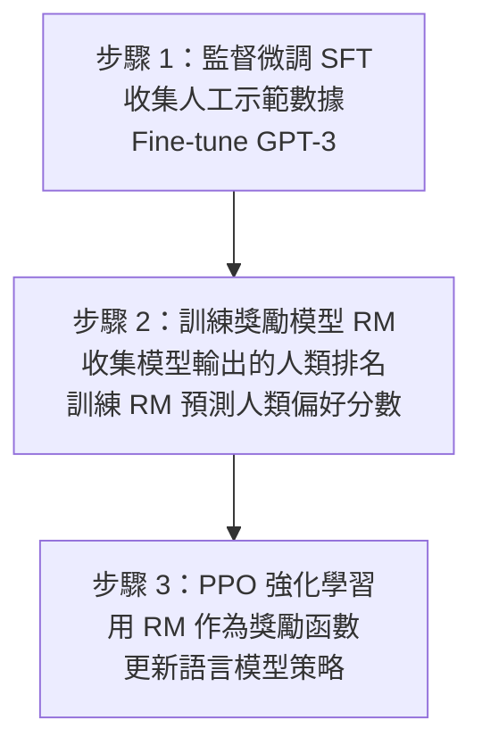

# KP-09：RLHF 與現代強化學習（RLHF & Modern RL）

> **課程關聯：** RL 基礎（MDP、Bellman、DQN）見 [[C3-W3 - Reinforcement Learning]]；本文延伸至如何將 RL 用於**對齊大型語言模型**。

---

## 1. 從 DQN 到 RLHF 的演化

---

## 2. 為什麼需要 RLHF？

**問題：** 大型語言模型（LLM）經過預訓練後，傾向於：
- 生成不真實、有毒或不相關的內容
- 「平均化」語言而非遵循用戶意圖

**RLHF 的目標（Alignment）：** 讓模型的行為與**人類偏好和價值觀**對齊（Helpful, Honest, Harmless — 3H 原則）。

---

## 3. RLHF 完整流程（InstructGPT）

### 3.1 三步驟

**論文來源：**
> Ouyang, L. et al. (2022). **Training Language Models to Follow Instructions with Human Feedback.** *NeurIPS 2022.* [arxiv:2203.02155](https://arxiv.org/abs/2203.02155)

**關鍵結果：** 1.3B 參數的 InstructGPT 在人類評估中優於 175B 的原始 GPT-3。

### 3.2 獎勵模型（Reward Model）

給定同一 prompt 的兩個回答 $y_w$（較佳）和 $y_l$（較差），訓練 RM 最大化偏好對的對數似然：

$$\mathcal{L}_{RM} = -\log \sigma\left(r_\phi(x, y_w) - r_\phi(x, y_l)\right)$$

---

## 4. PPO（Proximal Policy Optimization）

### 4.1 核心公式

PPO 的目標是最大化**裁剪的替代目標（Clipped Surrogate Objective）**：

$$\mathcal{L}^{\text{CLIP}}(\theta) = \mathbb{E}_t\left[\min\left(r_t(\theta) A_t,\; \text{clip}(r_t(\theta), 1-\epsilon, 1+\epsilon) A_t\right)\right]$$

其中：
- $r_t(\theta) = \frac{\pi_\theta(a_t|s_t)}{\pi_{\theta_{\text{old}}}(a_t|s_t)}$：新舊策略的概率比
- $A_t$：優勢函數（Advantage function），衡量動作比基線好多少
- $\epsilon$：裁剪閾值（通常 0.1–0.2），防止策略更新過大

**白話：** 「允許策略在獎勵好時更新，但不能更新太多（裁剪防止過大步長）。」

**論文來源：**
> Schulman, J. et al. (2017). **Proximal Policy Optimization Algorithms.** [arxiv:1707.06347](https://arxiv.org/abs/1707.06347)

### 4.2 RLHF 中的 PPO + KL 懲罰

$$r(x, y) = r_\phi(x, y) - \beta \cdot D_{\text{KL}}\left[\pi_\theta(y|x) \| \pi_{\text{ref}}(y|x)\right]$$

- $r_\phi(x, y)$：獎勵模型分數
- $\beta D_{\text{KL}}[\cdot]$：防止偏離原始模型（避免「獎勵黑客」— reward hacking）

---

## 5. Constitutional AI（Anthropic，2022）

**問題：** 人工標注偏好數據昂貴且可能有偏見。

**核心思想：** 用一套明文規則（Constitution）讓 AI 自我批評並修正輸出，再用 AI 生成的偏好對訓練 RM——**AI Feedback（RLAIF）** 替代部分人類標注。

**論文來源：**
> Bai, Y. et al. (2022). **Constitutional AI: Harmlessness from AI Feedback.** [arxiv:2212.08073](https://arxiv.org/abs/2212.08073)

---

## 6. DPO（Direct Preference Optimization）★ 重要突破

### 6.1 核心問題：RLHF 太複雜

RLHF 需要：
1. 訓練獨立的 Reward Model（額外模型）
2. PPO 訓練不穩定（超參數敏感）
3. 多模型同時在記憶體中（SFT, RM, RL policy, reference policy）

### 6.2 DPO 的推導

**關鍵洞察：** RLHF 的最優策略有閉合解：

$$\pi^*(y|x) = \frac{1}{Z(x)} \pi_{\text{ref}}(y|x) \exp\left(\frac{r(x,y)}{\beta}\right)$$

將此代入 Bradley-Terry 偏好模型，推導出：

$$\mathcal{L}_{\text{DPO}}(\pi_\theta) = -\mathbb{E}_{(x,y_w,y_l)}\left[\log \sigma\left(\beta \log \frac{\pi_\theta(y_w|x)}{\pi_{\text{ref}}(y_w|x)} - \beta \log \frac{\pi_\theta(y_l|x)}{\pi_{\text{ref}}(y_l|x)}\right)\right]$$

**白話：** 直接用偏好對 $(y_w, y_l)$ 訓練語言模型，**無需訓練 RM，無需 PPO**，只需一個標準的監督損失。

**論文來源：**
> Rafailov, R. et al. (2023). **Direct Preference Optimization: Your Language Model is Secretly a Reward Model.** *NeurIPS 2023.* [arxiv:2305.18290](https://arxiv.org/abs/2305.18290)

### 6.3 DPO vs RLHF

| | RLHF + PPO | DPO |
|--|----------|-----|
| 額外模型 | Reward Model | 無 |
| 訓練穩定性 | 低（PPO 敏感）| 高（監督損失）|
| 記憶體需求 | 高（多模型）| 低（兩模型）|
| 效果 | SOTA | 相當甚至更好 |
| 應用 | InstructGPT | Zephyr、Llama3 等 |

---

## 7. RL 在 LLM 之外的 2020+ 進展

### 7.1 AlphaCode（程式合成）

> Li, Y. et al. (2022). **Competition-Level Code Generation with AlphaCode.** *Science 2022.* [arxiv:2203.07814](https://arxiv.org/abs/2203.07814)

### 7.2 AlphaFold 2（蛋白質結構預測）

> Jumper, J. et al. (2021). **Highly Accurate Protein Structure Prediction with AlphaFold.** *Nature 2021.*

**雖非 RL，但體現了 ML 解決長期被認為「只有人類才能做到」問題的能力。**

### 7.3 Offline RL / Decision Transformer

**核心思想：** 把 RL 問題轉化為序列預測問題，用 Transformer 直接從離線資料學習最優策略（無需環境互動）。

> Chen, L. et al. (2021). **Decision Transformer: Reinforcement Learning via Sequence Modeling.** *NeurIPS 2021.* [arxiv:2106.01345](https://arxiv.org/abs/2106.01345)

---

## 8. RLHF 的問題與挑戰

| 問題 | 說明 |
|------|------|
| 獎勵黑客（Reward Hacking）| 模型學到欺騙 RM 的捷徑，而非真正提升質量 |
| 人類偏好一致性 | 不同標注者的偏好差異大，RM 訓練有噪聲 |
| 過度安全 | 模型可能拒絕合理請求（over-refusal）|
| 遺忘（Catastrophic Forgetting）| 微調可能損害預訓練能力 |
| 評估困難 | 「對齊」本身難以量化測量 |

---

## 9. 重點論文彙整

| 論文 | 年份 | arxiv | 貢獻 |
|------|------|-------|------|
| PPO | 2017 | [1707.06347](https://arxiv.org/abs/1707.06347) | 穩健 RL 策略優化，RLHF 基礎 |
| InstructGPT / RLHF | 2022 | [2203.02155](https://arxiv.org/abs/2203.02155) | LLM 對齊三步驟 |
| Constitutional AI | 2022 | [2212.08073](https://arxiv.org/abs/2212.08073) | AI Feedback 替代人工標注 |
| DPO | 2023 | [2305.18290](https://arxiv.org/abs/2305.18290) | 無 RM 偏好學習，更穩定 |
| Decision Transformer | 2021 | [2106.01345](https://arxiv.org/abs/2106.01345) | RL 轉化為序列建模 |

---

## 🔗 相關知識點

- [[KP-03 - 損失函數]] — RLHF 中的 KL 懲罰損失
- [[KP-06 - Attention 機制與 Transformer]] — LLM 是 RLHF 的基礎
- [[KP-07 - 縮放法則與湧現能力]] — 大模型才能有效進行 RLHF

## 🔗 相關課程筆記

- [[C3-W3 - Reinforcement Learning]] — MDP、Bellman、DQN 基礎
